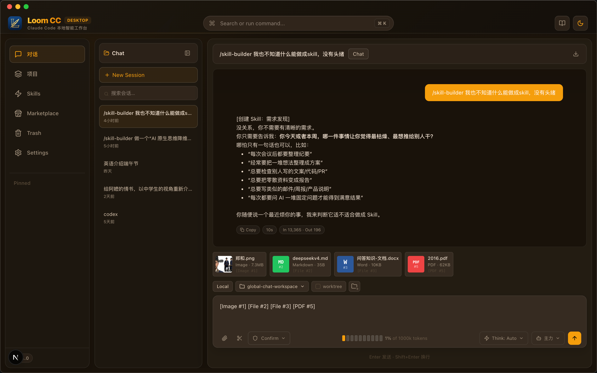
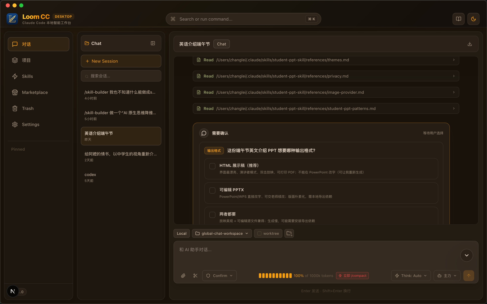
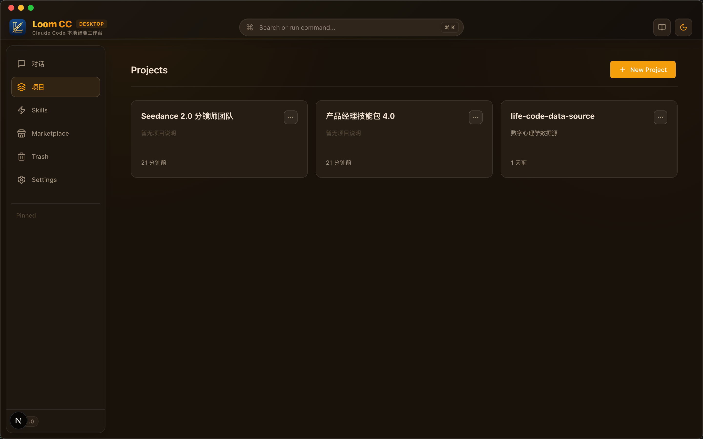
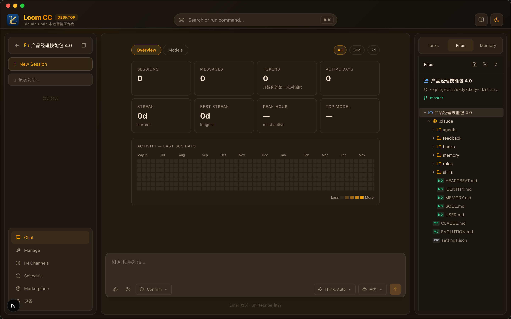
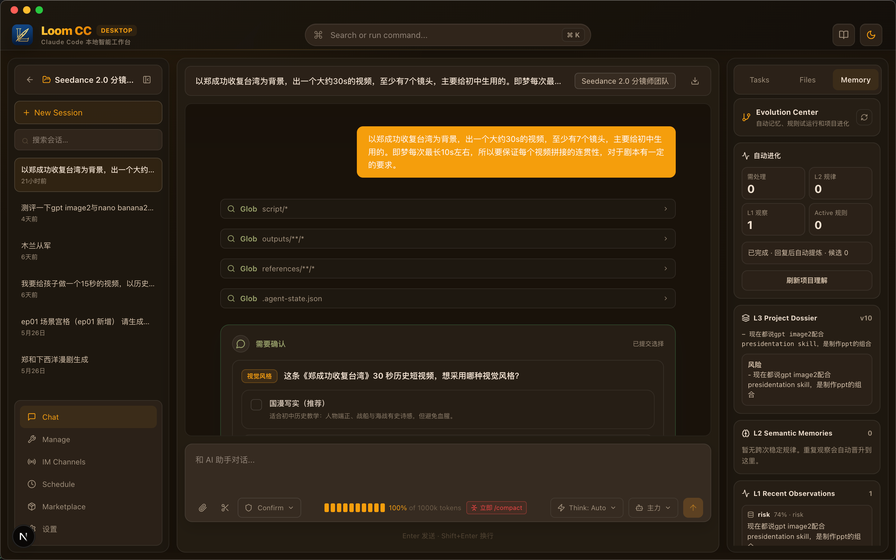
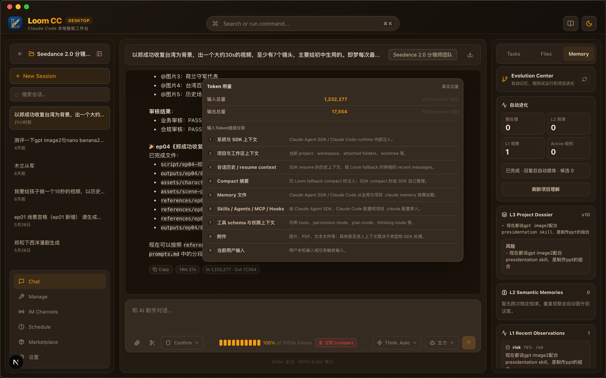
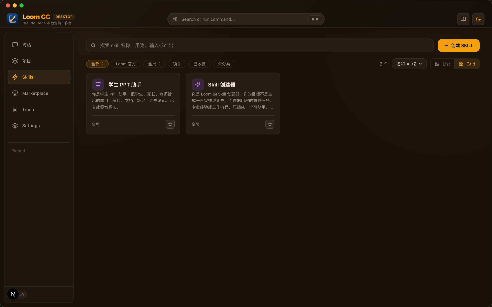
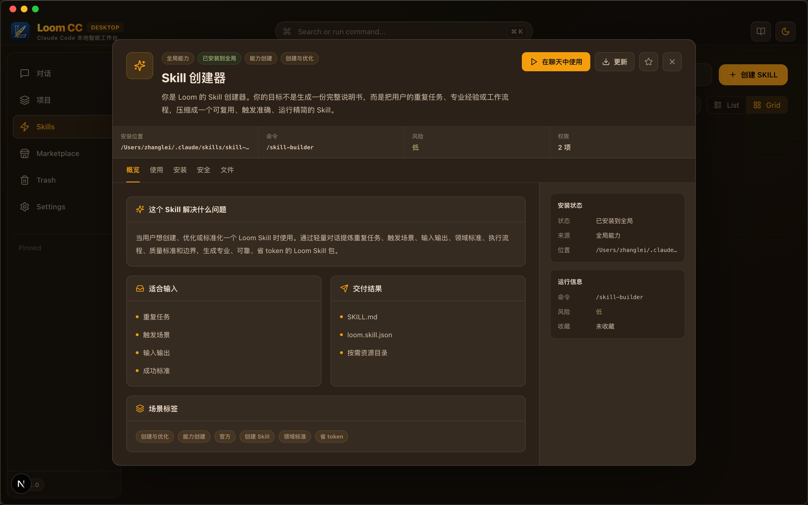

# Loom

**A local AI Agent workbench for everyday users.**

Loom is built on the **Claude Agent SDK** and brings Claude Code-level Agent capabilities into a desktop app. It is designed for everyday chat, project workspaces, tool use, file context, Memory, Skills, and visual permission confirmation. The goal is to cover part of the common Claude Code and Claude Desktop workflow in a local desktop experience.

Loom is both a local AI workbench that can be used directly and a tool for helping users understand, learn, and master AI Agents. On top of the Claude Agent SDK, users can configure different model providers such as Claude, ChatGPT, Qwen, Doubao, DeepSeek, GLM, or custom endpoints.

[](https://github.com/apollo8166/loom/releases)
[](https://github.com/apollo8166/loom/releases)
[](LICENSE)

[简体中文](README.zh-CN.md)

[Download](#download-and-install) | [Quick Start](#quick-start) | [Why Loom](#why-loom) | [Core Features](#core-features) | [Memory](#memory-and-context-management) | [Skills](#skills) | [Development](#development)

> Status: early open-source release. Loom already includes desktop chat, project workspaces, token statistics, Skills, memory, scheduled tasks, MCP / Agents management, image generation, and Feishu / Lark channel foundations. Harness, Marketplace, and the plugin system are still under active development.

<a id="screenshot-workbench-main"></a>

<p align="center">
  
</p>

---

## Why Loom

### Friendly to non-technical users

Claude Code is powerful, but the terminal has a real learning curve. Loom is designed to let users without programming knowledge start using Agents quickly: open the desktop app, choose a project or global chat, upload files, add screenshots, switch models, inspect tool calls, and see token usage.

Users do not need to understand CLI workflows, working directories, context compaction, MCP, Skills, or Sub-Agents at the beginning. Loom brings these capabilities into a visual interface so users can start using them first, then gradually learn how AI Agents work.

### Transparent and controllable token usage

The cost and quality of Agent work depend heavily on context management. Loom shows token usage directly in the chat view:

- Current session context usage.
- Input tokens, output tokens, and response duration.
- Context categories sent to the model: history, attachments, memory, Skills, tools, MCP, system context, and more.
- `/compact` suggestions and compaction records.
- SDK context usage and Auto Compact status.

This helps users see not only what the AI answered, but also why the answer consumed those tokens.

### Projects can evolve over time

Loom is not just a temporary chat window. Each project can retain and evolve its own way of working:

- Project working directory.
- Project-level `.claude/` configuration.
- Project memory and session history.
- Project Skills and Agents.
- Git, worktree, and working state.
- Scheduled tasks and long-running workflows.

As the project is used more often, it gradually develops its own context, rules, memories, and skills. Loom aims to make this part of project management instead of leaving it scattered across separate conversations.

### Memory is the core of project evolution

Loom Memory is not a simple summary file copied from chat history. It is a context management system designed for long-running project work.

It separates "what happened" from "how the project should be understood over time":

- **L0 facts**: append-only records of messages, operations, confirmations, rejections, and other factual events.
- **L1 recent observations**: preferences, risks, corrections, and state signals found in recent conversations.
- **L2 semantic memories**: stable patterns, project rules, and repeated feedback promoted across multiple observations.
- **L3 Project Dossier**: a stage-level understanding of the current project, used for future context injection.

Loom uses three gates, value filtering, confidence filtering, and promotion/deduplication filtering, to decide what should be remembered, discarded, or confirmed by the user. Ordinary conversations stay on a low-cost path so that project evolution does not become an extra model call on every turn.

### Harness: reusable Agent environments for business scenarios

In Loom, a Harness can be understood as an Agent runtime package for a specific business scenario. A Harness is not just a prompt. It can include:

- Project rules.
- Skills.
- Sub-Agents.
- MCP configuration.
- Permission policies.
- Directory structure.
- Template files.
- Example tasks.
- Industry workflows.

For example, "student PPT generation", "product requirement analysis", "investment research organization", "course lesson plan generation", and "browser automation testing" can all become different Harnesses. Once users choose a Harness, they get an Agent workflow that fits that scenario.

### Skills: content capabilities and Skill Builder

Loom includes a built-in Skills system. A Skill can be a content capability such as student PPTs, report generation, industry analysis, or writing templates. It can also be a tool workflow such as file organization, review rules, or automated checks.

More importantly, Loom includes a **Skill Builder**. It does not simply generate a long prompt. Instead, it uses a lightweight conversation to help users clarify:

- Task boundaries.
- Trigger conditions.
- Inputs and outputs.
- Domain dimensions.
- Execution strategy.
- Workflow.
- Quality standards.
- Risk boundaries.
- Token compression strategy.

The goal is to help everyday users turn their experience, workflows, and domain methods into professional, reliable, token-efficient Skills.

### Marketplace: industry-oriented templates

The direction of the Loom Marketplace is not to sell single plugins only. It is intended to provide Harness templates for different industries and workflows.

A Marketplace template can contain a full working solution: project rules, Skills, Agents, MCP, material templates, workflow instructions, and permission recommendations. Users can import a template and quickly start a vertical business workflow.

The Marketplace is still under construction. More industry templates and import capabilities will be added over time.

### Plugins: toward an extensible Agent ecosystem

Loom will support a more complete plugin system in the future. Plugins can provide or extend runtime environments, for example:

- Launching a browser runtime.
- Running browser automation tasks.
- Connecting external services.
- Providing industry tools.
- Extending Agent workflows.

This direction can evolve toward a local Agent platform with an extensible ecosystem.

---

## Quick Start

### Path A: Download and install

1. Open [Releases](https://github.com/apollo8166/loom/releases/latest).
2. Download the package for your device:
   - `loom-cc-v0.2.3-mac-arm64.dmg`: Apple Silicon / M-series Macs.
   - `loom-cc-v0.2.3-mac-x64.dmg`: Intel Macs.
3. Install and open Loom.
4. Configure model providers in Settings.
5. Start a global chat or choose a project working directory.

> Current macOS builds are Developer ID signed, notarized, stapled, and verified with Gatekeeper before release.

Packaged macOS apps bundle a matching Node.js v22 runtime and Claude CLI binary for the target architecture, so users do not need a system `node` install to launch the app. Release artifacts do not include local databases, provider credentials, or user settings. Those are created per user under the app data directory after first launch.

### Path B: Run from source

| Requirement | Minimum version |
|---|---|
| Node.js | 22+ |
| pnpm | 10+ |
| Git | Any modern version |

```bash
git clone https://github.com/apollo8166/loom.git
cd loom/loom-cc-client
pnpm install
pnpm dev
```

Common checks:

```bash
pnpm typecheck
pnpm build
```

Desktop packaging:

```bash
pnpm build:mac:arm64
pnpm build:mac:x64
pnpm build:win
```

---

## Core Features

### Chat input

<a id="screenshot-chat-input"></a>

<p align="center">
  
</p>

| Feature | Description |
|---|---|
| Pinned attachments | Pin files to the current session so the Agent can keep referencing them. |
| Attachment preview | Preview common files such as Office documents, PDFs, Markdown, images, and TXT. |
| Quick screenshot | Send screenshots directly into the current session. |
| Mode switching | Switch permission mode, plan mode, and other working modes. |
| Thinking controls | Choose different thinking or reasoning intensity levels. |
| Model switching | Switch models quickly within the current conversation. |
| Token display | Show current session context usage. |
| Working directory | Quickly create or select a working directory. |
| Git / worktree status | Display Git and worktree status for the current project. |
| Slash commands | Support `/clear`, `/compact`, `/skills`, `/agents`, `/mcp`, and more. |

### Chat display

<a id="screenshot-chat-display"></a>

<p align="center">
  
</p>

| Feature | Description |
|---|---|
| Token statistics | Show input, output, and context tokens. |
| Tool call UI | Display `tool_use`, tool results, Agents, Skills, and Workflow commands in structured UI. |
| AskUserQuestion | Provide visual choices in the chat page and persist user selections. |
| Permission confirmation | Show visual confirmation UI for operations that require authorization. |
| Copy | Copy AI response content. |
| Export | Export chat content with one action. |
| Duration display | Show AI response duration. |
| Token categories | Inspect the token composition of the current request to understand context cost. |

### Project workspace

<a id="screenshot-project-list"></a>

<p align="center">
  
</p>

<a id="screenshot-project-workspace"></a>

<p align="center">
  
</p>

| Feature | Description |
|---|---|
| Global chat | Chat in the default working directory when there is no specific project. |
| Project chat | Each project has its own sessions, working directory, and context. |
| Multiple sessions | Maintain multiple sessions within the same project. |
| Working directory | Let the Agent work around a real folder. |
| `.claude/` support | Project rules, Skills, Agents, and MCP can be kept with the project. |
| Memory / Evolution Center | Support global memory, project memory, L1/L2/L3 project evolution, and pending items. |
| Scheduled tasks | Support project-level scheduled tasks and automated execution. |

### Memory and context management

<a id="screenshot-memory-panel"></a>

<p align="center">
  
</p>

One of Loom's core strengths is Memory and context management. Here, "context" does not mean more is always better. It means the AI should see the information that is truly needed for the current task before answering.

An AI response may include the current input, session history, project workspace, attachments, Skills, Agents, MCP, tool permissions, compact summaries, global memory, project memory, and project evolution information. Loom organizes, compresses, filters, and displays this information so users do not have to guess what the AI actually saw.

| Capability | Description |
|---|---|
| Global memory | Store cross-project user preferences, output habits, working style, and repeated corrections. |
| Project memory | Store current project goals, business rules, key decisions, user feedback, retrospectives, and terminology. |
| L0 facts | Record messages, operations, confirmations, rejections, and other facts as append-only evidence. |
| L1 Recent Observations | Capture valuable recent signals such as preferences, risks, corrections, and state changes. |
| L2 Semantic Memories | Promote stable patterns, project rules, and long-term understanding across multiple observations. |
| L3 Project Dossier | Maintain a stage-level summary of goals, preferences, stable rules, recent risks, and next steps. |
| Three gates | Use value, confidence, and promotion/deduplication filters to control memory quality. |
| Negative Prior | User-rejected misunderstandings reduce the chance of similar candidates appearing again. |
| Lifecycle | Memories can be strengthened by evidence, or become stale, archived, or deprecated without new evidence. |
| Injection preview | Users can inspect the project dossier, stable memories, recent observations, and rules injected into the current turn. |

The Loom Memory panel is not a plain file list. It is an **Evolution Center**:

- Shows pending items, L2 pattern count, L1 observation count, and active rule count.
- Shows the L3 Project Dossier so users can understand how Loom currently sees the project.
- Shows L2 Semantic Memories so users can see which stable patterns may affect the AI.
- Shows L1 Recent Observations so users can see recent valuable signals.
- Puts only high-impact, conflicting, low-confidence, or user-requested items into the pending area.
- Supports `loom_context` injection preview for debugging why the AI answered in a certain way.

This mechanism lets projects evolve over time without blindly stuffing all history, evidence, and memory into every request.

### Token and context management

<a id="screenshot-token-panel"></a>

<p align="center">
  
</p>

Loom turns tokens from an invisible cost into observable, learnable, and manageable context. Memory and token management work together: a project can accumulate long-term memory, while each request injects only the relevant pieces within a budget.

| Feature | Description |
|---|---|
| Session Token | Current conversation context usage. |
| Input / output statistics | Input and output tokens for each AI response. |
| Context categories | Show system, project, history, Compact, Memory, Skills, tools, MCP, attachments, and current input composition. |
| Memory token control | Avoid injecting all memory into the prompt. Prioritize L3, then select L2, active rules, and a small amount of L1 by relevance. |
| Tool result slimming | Long tool outputs can be shown in the UI, while later context keeps only necessary summaries and key conclusions. |
| Attachment governance | Process attachments by size and type to avoid one file filling the context. |
| `/compact` | Manually compact session history while preserving goals, decisions, progress, todos, and important constraints. |
| Auto Compact | Show SDK automatic compaction status. |
| Compaction boundaries | Show compaction nodes and before/after information in chat history. |

### Skills

<a id="screenshot-skills"></a>
<a id="screenshot-skills-list"></a>

<p align="center">
  
</p>

Loom Skills are reusable capability packages. A Skill usually contains:

```text
skill-name/
├── SKILL.md
└── loom.skill.json
```

It can also include optional folders:

```text
references/  Long materials, domain rules, case libraries
scripts/     Stable deterministic operations that are repeated or error-prone
assets/      Templates, images, fonts, example materials
```

Current built-in examples:

| Skill | Description |
|---|---|
| `skill-builder` | Create, optimize, and standardize Loom Skills. |
| `student-ppt-skill` | Generate PPT / HTML workflows for student presentations, book reports, course presentations, and similar scenarios. |

The Skills menu prioritizes the official catalog under the repository `skills/` directory. Installation state is merged with user or project local copies.

<a id="screenshot-skills-skill"></a>

<p align="center">
  
</p>

### Skill Builder

<a id="screenshot-skill-builder"></a>
<!-- Screenshot anchor: Skill Builder creation flow, showing requirement confirmation, standard cards, and preview confirmation -->

Skill Builder is not about writing a long prompt. It helps users turn a repeated task into a high-quality Skill.

It controls three things:

- **Professionalism**: extract domain standards before generating files.
- **Reliability**: clarify triggers, boundaries, failure modes, and quality standards.
- **Token efficiency**: keep only runtime-critical content in the main file, put long materials in `references/`, and deterministic steps in `scripts/`.

When users do not know what to create, Skill Builder also supports a low-barrier discovery mode:

```text
What is the most boring thing you did today or this week, the thing you most wanted to hand off to someone else?
```

It first decides whether the task is worth turning into a Skill, instead of forcing a one-off task into a complex workflow.

### Agents and MCP

<a id="screenshot-agents-mcp"></a>
<!-- Screenshot anchor: /agents and /mcp command panels -->

Loom supports reading and displaying project or global Agents and MCP configuration, and exposing them through the chat command palette.

| Capability | Description |
|---|---|
| `/agents` | View available Sub-Agents. |
| `/mcp` | View or configure MCP Servers. |
| Project-level configuration | Read project capabilities from the project's `.claude/` directory. |
| Global configuration | Read the user's global Claude configuration. |

### Harness and Marketplace

<a id="screenshot-marketplace"></a>
<!-- Screenshot anchor: Marketplace page showing industry Harness template list and details -->

Loom aims to package mature business scenarios into Harness templates and reuse them through a Marketplace.

A future Harness template can include:

- Project rules.
- Skills.
- Agents.
- MCP.
- Template files.
- Initialization workflow.
- Permission recommendations.
- Example tasks.

The goal of Marketplace is to let users avoid starting Agent configuration from scratch. They can choose a workbench template that fits their industry scenario.

### Plugins

<a id="screenshot-plugins"></a>
<!-- Screenshot anchor: plugin capability page or future plugin market -->

The Loom plugin system is still being planned. In the future, plugins can extend Agent runtime environments and external capabilities, for example:

- Browser runtime environments.
- Browser automation.
- External system connectors.
- Industry tools.
- Custom workflows.

---

## Slash Commands

Type `/` in the chat input to open the command palette. Loom tries to preserve the native Claude Code CLI command experience while providing visual desktop entry points.

Common commands include:

| Command | Purpose |
|---|---|
| `/clear` | Clear the current context. |
| `/compact` | Compact session history and reduce context cost. |
| `/skills` | View or invoke Skills. |
| `/agents` | View Sub-Agents. |
| `/mcp` | View MCP Servers. |
| `/init` | Initialize project context. |
| `/model` | View or switch models. |

---

## Repository Layout

```text
loom/
├── loom-cc-client/   # Next.js + Electron desktop client
├── skills/           # Built-in Loom Skills catalog
├── docs/             # Open-source project documentation
├── CHANGELOG.md      # Changelog
├── CONTRIBUTING.md   # Contribution guide
└── LICENSE           # Apache-2.0 license
```

---

## Development

```bash
cd loom-cc-client
pnpm install
pnpm dev
```

Common commands:

```bash
pnpm typecheck
pnpm build
pnpm build:mac:arm64
pnpm build:mac:x64
pnpm build:win
```

More documentation:

- [Installation](docs/installation.md)
- [Development](docs/development.md)
- [Architecture](docs/architecture.md)
- [Skills](docs/skills.md)
- [Release Process](docs/release.md)
- [Changelog](CHANGELOG.md)

---

## Learning AI Agents

Loom is not only a tool. It is also intended to help users understand AI Agents.

Users can observe:

- How Agents read project context.
- Why certain tasks require authorization.
- How tool calls happen.
- When Skills are triggered.
- How Sub-Agents collaborate.
- How tokens are consumed.
- Why `/compact` reduces context pressure.
- How global memory and project memory are isolated.
- How L1 observations are promoted into stable L2 patterns.
- How the L3 Project Dossier affects future answers.
- Why not all history and memory should be injected into context.

For everyday users, this is easier to understand than starting directly with terminal commands and configuration files. For developers, Loom can also serve as a desktop workbench reference implementation for the Claude Agent SDK.

---

## Version

Current open-source baseline: `v0.2.3`.

Release notes: [docs/releases/v0.2.3.md](docs/releases/v0.2.3.md).

v0.2.3 keeps the image generation entry visible by default and guides users to Settings only when an image prompt is submitted without a configured provider or API key.

---

## Contributing

Issues, PRs, documentation improvements, and business Harness / Skill suggestions are welcome.

Please read [CONTRIBUTING.md](CONTRIBUTING.md) first.

---

## Security

Please do not open public issues for sensitive vulnerabilities. See [SECURITY.md](SECURITY.md).

---

## License

Licensed under the [Apache License 2.0](LICENSE).
